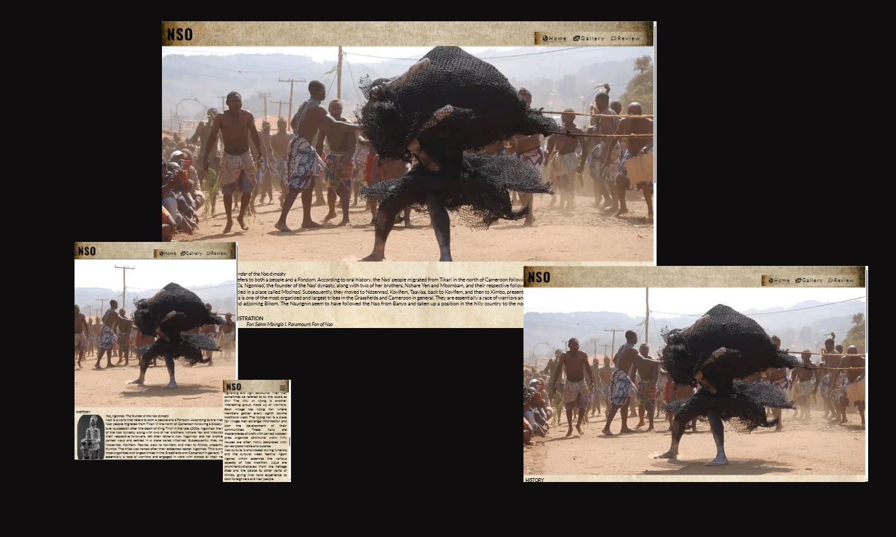

# NSO 
 The Lamnso' Literacy centre is currently exploring ways of educating the Nso people and equally foreigners about Nso' culture and tradition with the aim of boosting Tourism.
Any body can pay a visit to most of the heritage sites with a guide. 
The gallery provides some interesting images of culture, touristic sites and landscapes.

The Home page provides history and a brief understanding of Nso' and icons.
There is a form to collect tourist data and equally views about thier experience in the land. 
There are social media and information links on all pages of this project where users can get contacts and more information about Nso'

[View Nso live project here](https://guerric-k.github.io/Nso/)
- - -
## Table of Contents
### [User Experience (UX)](#user-experience-ux-1)
* [User Stories](#user-stories)
### [Design](#design-1)
### [Features](#features)
* [Existing Features](#existing-features)
### [Features Left to Implement](#features-left-to-implement-1)
### [Features](#features)
* [Existing Features](#existing-features)
### [Features Left to Implement](#features-left-to-implement-1)
